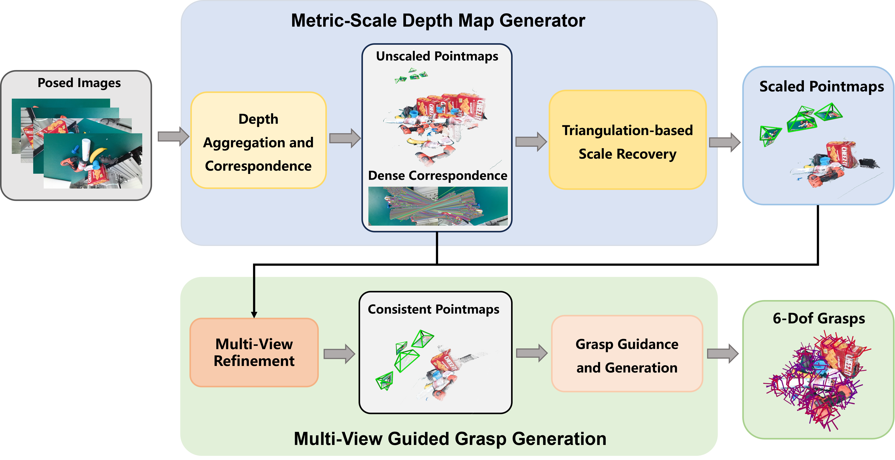

# MG-Grasp: **Metric-Scale Geometric 6-DoF Grasping Framework with Sparse RGB Observations**
[📄 Paper](https://arxiv.org/abs/2603.16270) | [🌐 Project Page](https://kx-wang77.github.io/MG-Grasp/)

## Introduction

MG-Grasp is a depth-free 6-DoF robotic grasping framework designed for sparse RGB observations. Instead of relying on depth sensors, it reconstructs metric-scale and multi-view consistent geometry from RGB images and generates reliable grasp poses for robotic manipulation.

This repository hosts the official project page and related media assets for MG-Grasp.

## Framework Overview

## Real-World Robot Grasping

**Code is coming soon.**

